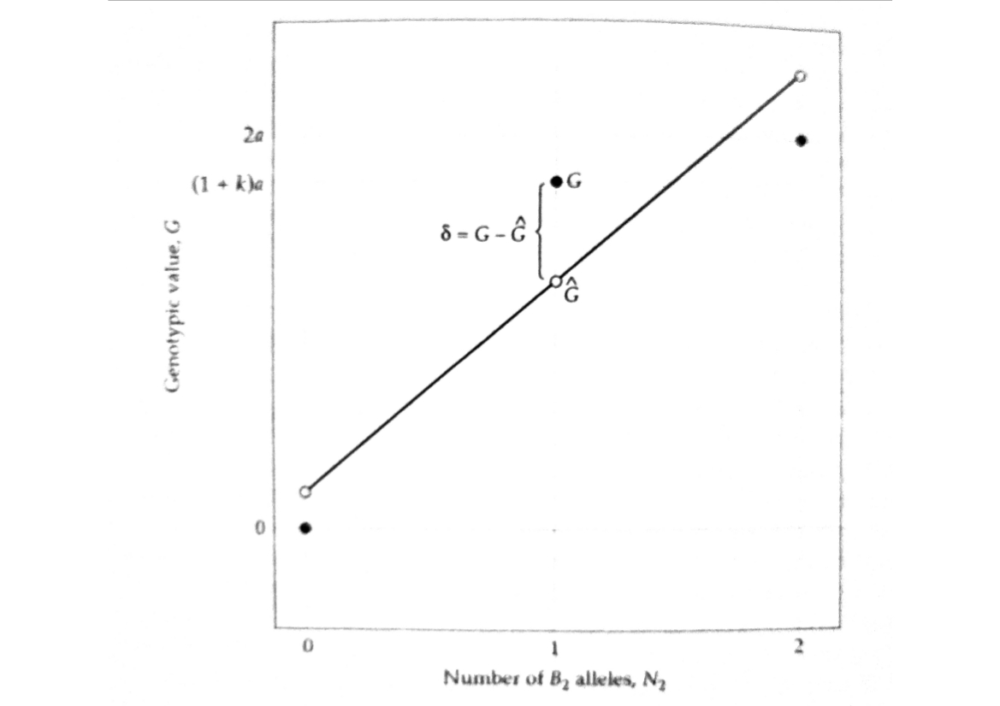

# Quantitative Genetics

## Decomposition of The Genetic Variance

<small>
Instructor: [A Augusto F Garcia](http://about.me/augusto.garcia)
/ [Statistical Genetics Lab](http://statgen.esalq.usp.br) </small>

<small>Department of Genetics, Luiz de Queiroz College of Agriculture,
University of São Paulo (Brazil)</small>

*** =pnotes

Some notes on the first slide

---

# Content

### Influence of a locus on the phenotype
### Fisher's decomposition of the genotypic value
### Partitioning the genetic variance
### Additive effects and breeding values
### Extensions for multiple alleles

---

### Influence of a locus on the phenotype

$$z = G + E$$

- $G$ is for the whole genotype (which is very complicated)
- Let us start with a single gene

- $k$ is the dominance
  - $k=0$ (no dominance), $k=1$ (full dominance), $k\geq 1$
  (overdominance)

---

# Fisher's decomposition (1918)

- Number of copies of a particular allele: **gene content**
- Relation between gene content and genotypic value (normally,
  non-linear)
- Partitioning genotypic values into their "expected" values based on
  additivity ($\hat{G}$) and deviations from those expectations
- Deviations: dominance ($\delta$)

---

### Regression model

$$G_{ij}=\hat{G}_{ij}+\delta_{ij}=\mu_G+\alpha_1N_1+\alpha_2N_2+\delta_{ij}$$

- This is a multiple regression model
- However, there is a constraint: $N_1=2-N_2$
  $$G_{ij}=\mu_{G}+\alpha_1(2-N_2)+\alpha_2N_2+\delta_{ij}$$
  $$G_{ij}=\iota + (\alpha_2-\alpha_1)N_2 + \delta_{ij}$$
- Where $\iota=\mu_G+2\alpha_1$
- The slope of this regression can be denoted as $\alpha=\alpha_2-\alpha_1$
- The (regression )model is therefore
  $$G_{ij}=\iota+\alpha N_2 + \delta_{ij}$$

---

### Graphical interpretation

---

- Notice that
  $$\hat{G}_{ij}=\mu_{G}+\alpha_{i}+\alpha_{j} = \left\{
  \begin{array}{lr} \mu_G+2\alpha_1 & for\; G_{11}\\
  \mu_G+\alpha_1+\alpha_2 & for\; G_{21}\\
  \mu_G+2\alpha_2 & for\; G_{22}\end{array}\right.$$
- By taking the expectation of
  $G_{ij}=\mu_G+\alpha_1N_1+\alpha_2N_2+\delta_{ij}$, it can be shown
  that
  $$\alpha_2=p_1\alpha$$
  $$\alpha_1=-p_2\alpha$$
- $p_1$ ($p_2$) is the frequency of allele $B_1$ ($B_2$)

---

- The slope of the regression (graphical representation) is
  $$\alpha=\frac{\sigma(G,N_2)}{\sigma^2(N_2)}$$
- To obtain $\alpha$, one needs to make a number of intermediate
  calculations
  - $E(N_2)$ and $E(N_2^2)$ for $\sigma^2(N_2)$
  - $E(GN)$, $E(G)$ and $E(N_2)$ for $\sigma(G,N_2)$
  - Expectations require "values" and "frequencies"
- Finally:

    $$\alpha=a[1+k(p_1-p_2)]$$
    

---

- Average effect of allelic substitution (under random mating)
  $$\alpha=a[1+k(p_1-p_2)]$$
- It represents the average change in genotypic value that results
  when a $B_1$ allele is randomly substituted for a $B_2$ allele
  - If $k=0$, $\alpha=a$
  - If $p_1=p_2$ (for example, in an $F_2$ population), $\alpha=a$
  - With dominance, the effect of an allelic substitution depends on
    the status of the unsubstituted allele
  - The effect of an allele can only be defined in the context of a
    population

---

| Genotype | Genotypic Value ($G$) | Gene content ($N_2$) | Freq. | $\hat{G}$ | $\delta=G-\hat{G}$ |
|:--------:|:---------------------:|:--------------------:|:---------:|:---------:|:------------------:|
| $B_1B_1$ | $0$        | $0$ | $p_1^2$   | $\iota$        | $-\iota$ |
| $B_1B_2$ | $(1+k)a$   | $1$ | $2p_1p_2$ | $\iota+\alpha$ | $(1+k)a-\iota-\alpha$ |
| $B_2B_2$ | $2a$       | $2$ | $p_2^2$   | $\iota+2\alpha$| $2a-\iota-2\alpha$ |

---

---

# Partitioning the genetic variance

- Given that $G = \hat{G} + \delta$, the total genetic variance is
$$\sigma_G^2=\sigma^2(\hat{G}+\delta)=\sigma^2(\hat{G})+2\sigma(\hat{G},\delta)+\sigma^2(\delta)$$
- Recall from regression properties that the predictor and the
  residual are uncorrelated (in this case, $\hat{G}$ and $\delta$)
- So, we can denote these components as
$$\sigma^2_G=\sigma^2_A+\sigma^2_D$$
  - $\sigma^2_A$ is the amount of variation explained by the
    regression on $N_2$ (**additive genetic variance**)
  - $\sigma^2_D$ is the residual variance for the regression
    (**dominance genetic variance**)

---

## Genetic variance

- Using $E(\hat{G}^2)$, $E(\hat{G})$, $E(\delta^2)$, $E(\delta)$, we
  can obtain:

  $$\sigma^2_A=E(\hat{G}^2)-[E(\hat{G})]^2=2p_1p_2\alpha^2$$
  
  $$\sigma^2_D=E(\delta^2)-[E(\delta)]^2=(2p_1p_2ak)^2$$

---

- solid line is $\sigma^2_G$, dashed line is $\sigma^2_A$, dotted line
  is $\sigma^2_D$
- $\sigma^2_A/\sigma^2_D$ **does not** provide information about
  additivity of gene action!

---

# Additive effects and breeding values

- In randomly mating diploids, each parent donates only **one allele
  per locus** to its offspring
- Additive effects are for each allele
- Dominance deviations are functions of the interaction between the
  two parental alleles
- So, dominance is eliminated when gametes are produced

> $\hat{G}$ and $\delta$ are the heritable and non-heritable
> components of an individual's genotypic value

---

### Additive effects

- The _additive effects_ $\alpha_i$ are defined to be the
  least-squares regression coefficients of genotypic values on gene
  content:
  $$\alpha_2=p_1\alpha=p_1a[1+k(p_1-p_2)]$$
  $$\alpha_1=-p_2\alpha=-p_2a[1+k(p_1-p_2)]$$
- They are equivalent to what is defined as _average excesses_ in
  random mating populations ("the difference between the mean
  genotypic value of individuals carrying at least one copy of a given
  allele and the mean genotypic value of the entire population")

--- ds:blue

### Breeding value

> An individual's **breeding value** ($A$) is the sum of the additive
> effects of its genes

- The breeding value of $B_1B_1$ is $2\alpha_1$
- The breeding value of $B_1B_2$ is $\alpha_1+\alpha_2$
- The breeding value of $B_2B_2$ is $2\alpha_2$

---

#### Breeding value

- If one crosses individuals with a given breeding value with a random
  sample of the entire population, it is possible to estimate the
  average genotypic value of offspring. By subtracting the mean, we
  have a very useful result.
- Deviations are _half_ of the breeding value 

| Parental genotype | Breeding value | Mean genotypic value of progeny | Deviation of expected progeny mean from $\mu_G$ |
| ----------------- | -------------- | ------------------------------- | --------------- |
| $B_2B_2$ | $2\alpha_2$         | $p_2(2a)+p_1a(1+k)$ | $\alpha_2$ |
| $B_1B_2$ | $\alpha_1+\alpha_2$ | $a[p_2+(1+k)/2]$   | $(\alpha_1+\alpha_2)/2$ |
| $B_1B_1$ | $2\alpha_1$         | $ap_2(1+k)$      | $\alpha_1$ |

> We can estimate the breeding value by crossing to random
> individuals, taking the average of progeny, subtracting it from the
> overall mean, and then multiplying by 2

---

## A very useful interpretation

- Remember that $G_{ij}=\mu_G+\alpha_i+\alpha_j+\delta_{ij}$
- This is the same as using the model
  $G_{ij}=\mu_G+\alpha_1N_1+\alpha_2N_2+\delta_{ij}$
- $G_{ij}=\mu_G+A_{ij}+\delta_{ij}$ (indicating the breeding value)
- Then
  $$\sigma^2_G=\sigma^2(\alpha_i+\alpha_j)+\sigma^2(\delta_{ij})$$
- But
  $$\sigma^2_G=\sigma^2_A+\sigma^2_D$$

> The genetic variance is equivalent to the variance of breeding
> values of individuals in the population

---

# Extension for multiple alleles

- Generalizations:
  $$G=\mu_G+\sum_{i=1}^n \alpha_iN_i+\delta$$
  $$\alpha_i=\sum_{j=1}^n p_jG_{ij}-\mu_G$$
  $$\sigma^2_A=2\sum_{i=1}^n p_i\alpha^2_i$$

--- ds:indigo

# Homework

  - Read Chapter 4 of Lynch and Walsh Book
