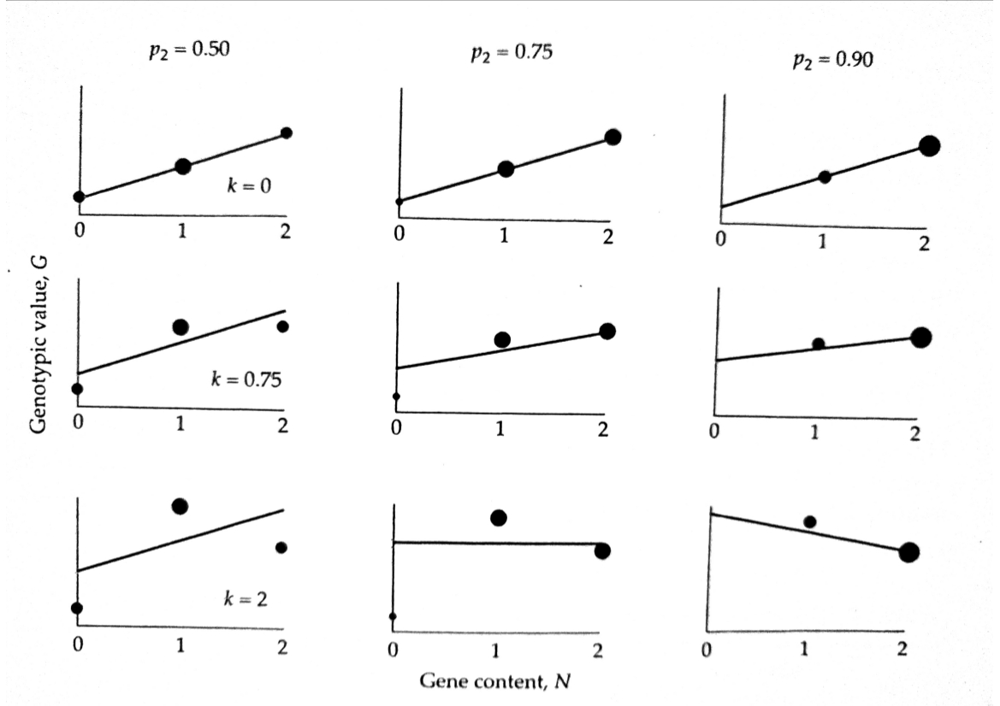

# Quantitative Genetics

## Decomposition of The Genetic Variance

<small>
Instructor: [A Augusto F Garcia](http://about.me/augusto.garcia)
/ [Statistical Genetics Lab](http://statgen.esalq.usp.br) </small>

<small>Department of Genetics, Luiz de Queiroz College of Agriculture,
University of São Paulo (Brazil)</small>

*** =pnotes

Some notes on the first slide

---

# Content

### Influence of a locus on the phenotype
### Fisher's decomposition of the genotypic value
### Partitioning the genetic variance
### Additive effects, average excesses, breeding values
### Extensions for multiple alleles

---

### Influence of a locus on the phenotype

$$z = G + E$$

- $G$ is for the whole genotype (which is very complicated)
- Let us start with a single gene

- $k$ is the dominance
  - $k=0$ (no dominance), $k=1$ (full dominance), $k\geq 1$
  (overdominance)

---

# Fisher's decomposition (1918)

- Number of copies of a particular allele: **gene content**
- Relation between gene content and genotypic value (normally,
  non-linear)
- Partitioning genotypic values into their "expected" values based on
  additivity ($\hat{G}$) and deviations from those expectations
- Deviations: dominance ($\delta$)

---

### Regression model

$$G_{ij}=\hat{G}_{ij}+\delta_{ij}=\mu_G+\alpha_1N_1+\alpha_2N2+\delta_{ij}$$

- This is a multiple regression model
- However, there is a constraint: $N_1=2-N_2$
  $$G_{ij}=\mu_{G}+\alpha_1(2-N_2)+\alpha_2N_2+\delta_{ij}$$
  $$G_{ij}=\iota + (\alpha_2-\alpha_1)N_2 + \delta_{ij}$$
- Where $\iota=\mu_G+2\alpha_1$
- The slope of this regression can be denoted as $\alpha=\alpha_2-\alpha_1$
- The (regression )model is therefore
  $$G_{ij}=\iota+\alpha N_2 + \delta_{ij}$$

---

### Graphical interpretation

---

- Notice that
  $$\hat{G}_{ij}=\mu_{G}+\alpha_{i}+\alpha_{j} = \left\{
  \begin{array}{lr} \mu_G+2\alpha_1 & for\; G_{11}\\
  \mu_G+\alpha_1+\alpha_2 & for\; G_{21}\\
  \mu_G+2\alpha_2 & for\; G_{22}\end{array}\right.$$
- By taking the expectation of
  $G_{ij}=\mu_G+\alpha_1N_1+\alpha_2N_2+\delta_{ij}$, it can be shown
  that
  $$\alpha_2=p_1\alpha$$
  $$\alpha_1=-p_2\alpha$$
- $p_1$ ($p_2$) is the frequency of allele $B_1$ ($B_2$)

---

- The slope of the regression (graphical representation) is
  $$\alpha=\frac{\sigma(G,N_2)}{\sigma^2(N_2)}$$
- To obtain $\alpha$, one needs to make a number of intermediate
  calculations
  - $E(N_2)$ and $E(N_2^2)$ for $\sigma^2(N_2)$
  - $E(GN)$, $E(G)$ and $E(N_2)$ for $\sigma(G,N_2)$
  - Expectations require "values" and "frequencies"
- Finally:

    $$\alpha=a[1+k(p_1-p_2)]$$
    

---

- Average effect of allelic substitution (under random mating)
  $$\alpha=a[1+k(p_1-p_2)]$$
- It represents the average change in genotypic value that results
  when a $B_1$ allele is randomly substituted for a $B_2$ allele
  - If $k=0$, $\alpha=a$
  - If $p_1=p_2$ (for example, in an $F_2$ population), $\alpha=a$
  - With dominance, the effect of an allelic substitution depends on
    the status of the unsubstituted allele
  - The effect of an allele can only be defined in the context of a
    population

---

--- ds:indigo

# Homework

  - Read Chapter 2 and 3 of Lynch and Walsh Book
